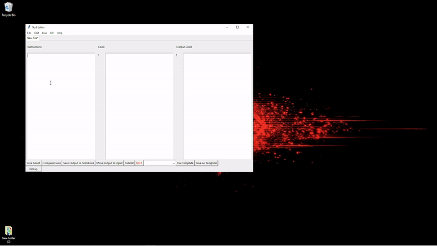

# SW_IDE (Self Writing IDE)

This repo is a test on handling an entire project, all written using the codex language model,
either in Complete mode or the Edit mode For the codex model.  The point is to try different methods to generate using a prompt and the code template to develop full features in the application. 
Nearly all of the code in this project was generated by the model, using only some guidance and verification of the code from my side.

### the following lines were generated by Codex in Edit mode
the only change I made is removing the emil and adding this comment.

_________________________

## Introduction

This is a project that I am working on to create a self writing IDE.

## What is a self writing IDE?

A self writing IDE is an IDE that can write itself.

## How does it work?

The IDE will be written in a language called codex.

Codex is a language that is designed to be able to write itself.

The IDE will be written in codex and will be able to write codex.

## Why?

I am doing this project because I want to learn more about programming languages and how they work.

## How can I help?

If you want to help you can contact me at [my email](mailto:a.b@c.com)

## What is the current status of the project?

The project is currently in the planning stage.

## What is the current plan?

The current plan is to create a language called codex.

Codex will be a language that is designed to be able to write itself.

Codex will be written in python.

Codex will be able to write python.

Codex will be able to write codex.

Codex will be able to write itself.

Codex will be able to write the IDE.

The IDE will be written in codex.
